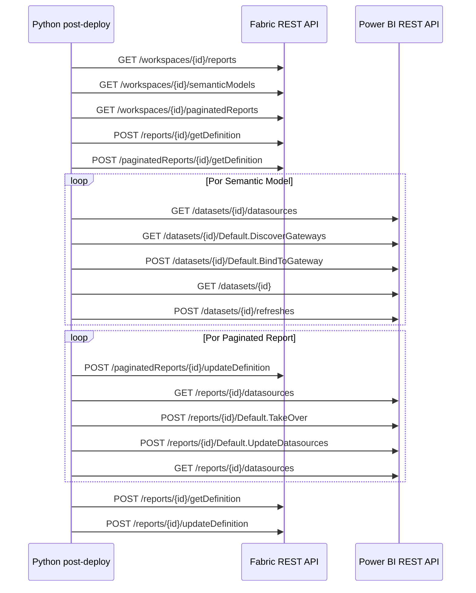

# APIs utilizadas por la aplicación de post-deploy de Power BI / Microsoft Fabric

## 1. Alcance

Este documento describe las APIs REST utilizadas por la aplicación Python incluida en `fix-rdl-pbi-py-main(2).zip`.

La aplicación utiliza dos superficies REST diferentes:

```text
Microsoft Fabric REST API
https://api.fabric.microsoft.com/v1

Power BI REST API
https://api.powerbi.com/v1.0/myorg
```

La autenticación se obtiene mediante Azure CLI (`az account get-access-token`) solicitando tokens para:

```text
https://api.fabric.microsoft.com
https://analysis.windows.net/powerbi/api
```

Los enlaces de este documento apuntan a documentación oficial de Microsoft Learn y fueron verificados el 15-septiembre-2026.

---


## Convenciones de ejemplos HTTP

Los ejemplos de esta documentación muestran la forma en que la aplicación consume las APIs. Los valores entre `<...>` son variables y deben sustituirse en tiempo de ejecución.

### Headers de solicitud comunes

Para Microsoft Fabric REST API:

```http
Authorization: Bearer <fabric_access_token>
Content-Type: application/json
Accept: application/json
```

Para Power BI REST API:

```http
Authorization: Bearer <powerbi_access_token>
Content-Type: application/json
Accept: application/json
```

En operaciones `GET` sin body, `Content-Type` puede omitirse. La aplicación utiliza clientes HTTP separados para Fabric y Power BI porque los tokens se solicitan para recursos distintos.

### Headers de respuesta relevantes

La aplicación registra todos los headers recibidos en los artefactos de diagnóstico. Los headers funcionalmente más importantes son:

| Header | Plataforma | Uso |
|---|---|---|
| `x-ms-operation-id` | Fabric | Identifica una operación de larga duración. |
| `Location` | Fabric / Power BI | URL para consultar una operación o recurso asociado. |
| `Retry-After` | Fabric | Segundos que deben esperarse antes del siguiente polling. |
| `x-ms-request-id` | Power BI | Identificador de correlación de la solicitud. |
| `Content-Type` | Ambas | Tipo de contenido de la respuesta. |

Cuando una API no documenta un header funcional específico para el flujo, esta guía indica que no existe ningún header adicional que el código necesite interpretar.

---

## 2. Microsoft Fabric REST API

### 2.1 Listar reportes del workspace

**Uso:** descubrir los reportes PBIR existentes en el workspace destino.

```http
GET https://api.fabric.microsoft.com/v1/workspaces/{workspaceId}/reports
```

Código: `workspace.py -> list_fabric_workspace_items()`.

Documentación oficial:

https://learn.microsoft.com/en-us/rest/api/fabric/report/items/list-reports

---

#### Request

```http
GET https://api.fabric.microsoft.com/v1/workspaces/<workspaceId>/reports
Authorization: Bearer <fabric_access_token>
Accept: application/json
```

Body: no aplica.

#### Response

**HTTP 200 OK**

Respuesta representativa:

```json
{
  "value": [
    {
      "id": "<reportId>",
      "displayName": "Devolución de Pagos SJL",
      "description": null
    }
  ]
}
```

Headers relevantes para la aplicación:

```http
Content-Type: application/json
```

No existe un header adicional que el flujo necesite interpretar para esta operación. Si la API pagina resultados, la aplicación continúa con la URL de continuación devuelta por la respuesta.


### 2.2 Listar modelos semánticos

**Uso:** descubrir los modelos semánticos del workspace destino y obtener sus IDs reales.

```http
GET https://api.fabric.microsoft.com/v1/workspaces/{workspaceId}/semanticModels
```

Código: `workspace.py -> list_fabric_workspace_items()`.

Documentación oficial:

https://learn.microsoft.com/en-us/rest/api/fabric/semanticmodel/items/list-semantic-models

---

#### Request

```http
GET https://api.fabric.microsoft.com/v1/workspaces/<workspaceId>/semanticModels
Authorization: Bearer <fabric_access_token>
Accept: application/json
```

Body: no aplica.

#### Response

**HTTP 200 OK**

```json
{
  "value": [
    {
      "id": "<semanticModelId>",
      "displayName": "Devolución de Pagos SJL",
      "description": null
    }
  ]
}
```

Headers relevantes:

```http
Content-Type: application/json
```

La propiedad `id` es el identificador real que posteriormente se utiliza para construir la referencia runtime del informe paginado.


### 2.3 Listar informes paginados

**Uso:** descubrir los informes paginados y conservar sus IDs existentes.

```http
GET https://api.fabric.microsoft.com/v1/workspaces/{workspaceId}/paginatedReports
```

Código: `workspace.py -> list_fabric_workspace_items()`.

Documentación oficial:

https://learn.microsoft.com/en-us/rest/api/fabric/paginatedreport/items/list-paginated-reports

---

#### Request

```http
GET https://api.fabric.microsoft.com/v1/workspaces/<workspaceId>/paginatedReports
Authorization: Bearer <fabric_access_token>
Accept: application/json
```

Body: no aplica.

#### Response

**HTTP 200 OK**

```json
{
  "value": [
    {
      "id": "<paginatedReportId>",
      "displayName": "Devolución de Pagos SJL Aceptada",
      "description": null
    }
  ]
}
```

Headers relevantes:

```http
Content-Type: application/json
```

La aplicación conserva este `id`; no elimina ni recrea el objeto durante la remediación.


### 2.4 Obtener definición de un reporte

**Uso:** leer los archivos de definición del reporte principal y localizar los `rdlVisual`.

```http
POST https://api.fabric.microsoft.com/v1/workspaces/{workspaceId}/reports/{reportId}/getDefinition
```

Código: `workspace.py -> get_report_definition()` y `_get_definition()`.

Documentación oficial:

https://learn.microsoft.com/en-us/rest/api/fabric/report/items/get-report-definition

---

#### Request

```http
POST https://api.fabric.microsoft.com/v1/workspaces/<workspaceId>/reports/<reportId>/getDefinition
Authorization: Bearer <fabric_access_token>
Content-Type: application/json
Accept: application/json
```

Body:

```json
{}
```

La implementación puede enviar el POST sin un body funcional.

#### Response síncrona

**HTTP 200 OK**

```json
{
  "definition": {
    "parts": [
      {
        "path": "definition/pages/<pageId>/visuals/<visualId>/visual.json",
        "payload": "<InlineBase64>",
        "payloadType": "InlineBase64"
      }
    ]
  }
}
```

#### Response asíncrona

**HTTP 202 Accepted**

Body normalmente vacío.

Headers críticos:

```http
Location: https://api.fabric.microsoft.com/v1/operations/<operationId>
x-ms-operation-id: <operationId>
Retry-After: <seconds>
```

La aplicación usa `x-ms-operation-id` para consultar el estado mediante la API de LRO.


### 2.5 Actualizar definición de un reporte

**Uso:** actualizar los `visual.json` del reporte principal con el `itemId` real del informe paginado y el `workspaceId` destino.

```http
POST https://api.fabric.microsoft.com/v1/workspaces/{workspaceId}/reports/{reportId}/updateDefinition
```

Cuerpo simplificado:

```json
{
  "definition": {
    "parts": [
      {
        "path": "definition/pages/.../visual.json",
        "payload": "<Base64>",
        "payloadType": "InlineBase64"
      }
    ]
  }
}
```

Código: `workspace.py -> update_report_definition()`.

Documentación oficial:

https://learn.microsoft.com/en-us/rest/api/fabric/report/items/update-report-definition

---

#### Request

```http
POST https://api.fabric.microsoft.com/v1/workspaces/<workspaceId>/reports/<reportId>/updateDefinition
Authorization: Bearer <fabric_access_token>
Content-Type: application/json
Accept: application/json
```

Body representativo:

```json
{
  "definition": {
    "parts": [
      {
        "path": "definition/pages/<pageId>/visuals/<visualId>/visual.json",
        "payload": "<Base64-del-visual.json-corregido>",
        "payloadType": "InlineBase64"
      }
    ]
  }
}
```

El `visual.json` actualizado contiene los valores reales:

```json
{
  "itemId": "<paginatedReportId-destino>",
  "workspaceId": "<workspaceId-destino>"
}
```

#### Response

Puede ser:

```http
200 OK
```

o:

```http
202 Accepted
Location: https://api.fabric.microsoft.com/v1/operations/<operationId>
x-ms-operation-id: <operationId>
Retry-After: <seconds>
```

Cuando recibe `202`, la aplicación entra al flujo de polling de LRO.


### 2.6 Obtener definición de un informe paginado

**Uso:** leer el RDL actual del informe paginado y analizar nombres de datasource, parámetros y referencias al modelo semántico.

```http
POST https://api.fabric.microsoft.com/v1/workspaces/{workspaceId}/paginatedReports/{paginatedReportId}/getDefinition
```

Código: `workspace.py -> get_paginated_report_definition()` y `_get_definition()`.

Documentación oficial:

https://learn.microsoft.com/en-us/rest/api/fabric/paginatedreport/items/get-paginated-report-definition

**Importante para este tenant:** la implementación omite el query string `format`. Microsoft documenta el parámetro como opcional y establece `PaginatedReportDefinition` como valor predeterminado. En este tenant, enviar explícitamente `?format=PaginatedReportDefinition` produjo `InvalidDefinitionFormat`.

Documentación de la estructura de definición:

https://learn.microsoft.com/en-us/rest/api/fabric/articles/item-management/definitions/paginatedreport-definition

---

#### Request

```http
POST https://api.fabric.microsoft.com/v1/workspaces/<workspaceId>/paginatedReports/<paginatedReportId>/getDefinition
Authorization: Bearer <fabric_access_token>
Content-Type: application/json
Accept: application/json
```

La aplicación **no agrega**:

```text
?format=PaginatedReportDefinition
```

y tampoco envía un campo JSON `format`.

#### Response síncrona

**HTTP 200 OK**

```json
{
  "definition": {
    "parts": [
      {
        "path": "Devolución de Pagos SJL Aceptada.rdl",
        "payload": "<RDL-XML-en-Base64>",
        "payloadType": "InlineBase64"
      }
    ]
  }
}
```

#### Response asíncrona

**HTTP 202 Accepted**

```http
Location: https://api.fabric.microsoft.com/v1/operations/<operationId>
x-ms-operation-id: <operationId>
Retry-After: <seconds>
```

Body: vacío.

Microsoft documenta `format` como opcional. En este tenant se utiliza deliberadamente el formato predeterminado porque el envío explícito de `PaginatedReportDefinition` produjo `InvalidDefinitionFormat`.


### 2.7 Actualizar definición de un informe paginado

**Uso:** modificar el RDL del informe paginado sin eliminarlo ni recrearlo, preservando su `itemId`.

```http
POST https://api.fabric.microsoft.com/v1/workspaces/{workspaceId}/paginatedReports/{paginatedReportId}/updateDefinition
```

Código: `workspace.py -> update_paginated_report_definition()` y `paginated.py`.

Documentación oficial:

https://learn.microsoft.com/en-us/rest/api/fabric/paginatedreport/items/update-paginated-report-definition

La aplicación realiza la actualización **in-place**. No utiliza Create/Delete para la corrección normal del RDL.

---

#### Request

```http
POST https://api.fabric.microsoft.com/v1/workspaces/<workspaceId>/paginatedReports/<paginatedReportId>/updateDefinition
Authorization: Bearer <fabric_access_token>
Content-Type: application/json
Accept: application/json
```

Body:

```json
{
  "definition": {
    "parts": [
      {
        "path": "Devolución de Pagos SJL Aceptada.rdl",
        "payload": "<RDL-XML-corregido-en-Base64>",
        "payloadType": "InlineBase64"
      }
    ]
  }
}
```

La aplicación modifica el mismo `paginatedReportId`.

#### Response

Puede completarse inmediatamente o como LRO.

Ejemplo LRO:

```http
HTTP/1.1 202 Accepted
Location: https://api.fabric.microsoft.com/v1/operations/<operationId>
x-ms-operation-id: <operationId>
Retry-After: 5
```

La respuesta no obliga a recrear el informe paginado; `updateDefinition` mantiene la identidad del objeto.


### 2.8 Consultar una operación de larga duración

Algunas operaciones Fabric devuelven `202 Accepted` y un header `x-ms-operation-id`.

La aplicación consulta:

```http
GET https://api.fabric.microsoft.com/v1/operations/{operationId}
```

Código: `http_clients.py -> wait_for_lro_completion()` y `get_json_lro_result()`.

Documentación oficial:

https://learn.microsoft.com/en-us/rest/api/fabric/core/long-running-operations/get-operation-state

---

#### Request

```http
GET https://api.fabric.microsoft.com/v1/operations/<operationId>
Authorization: Bearer <fabric_access_token>
Accept: application/json
```

#### Response

**HTTP 200 OK**

```http
Location: https://api.fabric.microsoft.com/v1/operations/<operationId>
x-ms-operation-id: <operationId>
Retry-After: 20
Content-Type: application/json
```

Body representativo:

```json
{
  "status": "Running",
  "createdTimeUtc": "2026-09-15T20:10:00Z",
  "lastUpdatedTimeUtc": "2026-09-15T20:10:10Z"
}
```

Estados terminales esperados por el cliente:

```text
Succeeded
Failed
```

Si el servicio devuelve `429 Too Many Requests`, debe respetarse `Retry-After`.


### 2.9 Obtener el resultado de una operación de larga duración

Cuando la operación finaliza correctamente, la aplicación puede obtener el resultado mediante:

```http
GET https://api.fabric.microsoft.com/v1/operations/{operationId}/result
```

Código: `http_clients.py -> get_json_lro_result()`.

Documentación oficial:

https://learn.microsoft.com/en-us/rest/api/fabric/core/long-running-operations/get-operation-result

---

#### Request

```http
GET https://api.fabric.microsoft.com/v1/operations/<operationId>/result
Authorization: Bearer <fabric_access_token>
Accept: application/json
```

#### Response

**HTTP 200 OK**

El body depende de la operación que originó el LRO. Para un `getDefinition`, el resultado esperado tiene la forma:

```json
{
  "definition": {
    "parts": [
      {
        "path": "<definition-part-path>",
        "payload": "<InlineBase64>",
        "payloadType": "InlineBase64"
      }
    ]
  }
}
```

Headers relevantes:

```http
Content-Type: application/json
```

La aplicación solicita este endpoint únicamente cuando la operación ya terminó exitosamente y existe un resultado.


## 3. Power BI REST API

### 3.1 Obtener un modelo semántico / dataset

**Uso:** consultar propiedades del modelo semántico, principalmente `isRefreshable` antes de solicitar un refresh.

```http
GET https://api.powerbi.com/v1.0/myorg/groups/{workspaceId}/datasets/{datasetId}
```

Código: `semantic_refresh.py -> _dataset_info()`.

Documentación oficial:

https://learn.microsoft.com/en-us/rest/api/power-bi/datasets/get-dataset-in-group

---

#### Request

```http
GET https://api.powerbi.com/v1.0/myorg/groups/<workspaceId>/datasets/<datasetId>
Authorization: Bearer <powerbi_access_token>
Accept: application/json
```

#### Response

**HTTP 200 OK**

Respuesta representativa:

```json
{
  "id": "<datasetId>",
  "name": "Devolución de Pagos SJL",
  "isRefreshable": true
}
```

Headers funcionales utilizados:

```http
Content-Type: application/json
```

La propiedad relevante para `semantic_refresh.py` es `isRefreshable`.


### 3.2 Obtener datasources de un modelo semántico

**Uso:** inspeccionar el datasource Oracle del modelo y determinar si ya está asociado a un gateway/datasource.

```http
GET https://api.powerbi.com/v1.0/myorg/groups/{workspaceId}/datasets/{datasetId}/datasources
```

Código: `powerbi_gateway.py -> _get_dataset_datasources()`.

Documentación oficial:

https://learn.microsoft.com/en-us/rest/api/power-bi/datasets/get-datasources-in-group

---

#### Request

```http
GET https://api.powerbi.com/v1.0/myorg/groups/<workspaceId>/datasets/<datasetId>/datasources
Authorization: Bearer <powerbi_access_token>
Accept: application/json
```

#### Response

**HTTP 200 OK**

Ejemplo representativo para Oracle:

```json
{
  "value": [
    {
      "datasourceType": "Oracle",
      "connectionDetails": {
        "server": "NCI_QA_DB"
      },
      "gatewayId": "<gatewayId>",
      "datasourceId": "<gatewayDatasourceId>"
    }
  ]
}
```

La aplicación inspecciona `datasourceType`, `connectionDetails`, `gatewayId` y `datasourceId` para determinar el estado del binding.


### 3.3 Descubrir gateways compatibles

**Uso:** obtener los gateways a los que Power BI considera que el modelo semántico puede vincularse.

```http
GET https://api.powerbi.com/v1.0/myorg/groups/{workspaceId}/datasets/{datasetId}/Default.DiscoverGateways
```

Código: `powerbi_gateway.py -> _discover_gateways()`.

Documentación oficial:

https://learn.microsoft.com/en-us/rest/api/power-bi/datasets/discover-gateways-in-group

---

#### Request

```http
GET https://api.powerbi.com/v1.0/myorg/groups/<workspaceId>/datasets/<datasetId>/Default.DiscoverGateways
Authorization: Bearer <powerbi_access_token>
Accept: application/json
```

#### Response

**HTTP 200 OK**

Ejemplo basado en el esquema oficial:

```json
{
  "value": [
    {
      "id": "<gatewayId>",
      "name": "Operaciones5.0-DG-DevQA",
      "type": "Resource",
      "gatewayStatus": "Online",
      "publicKey": {
        "exponent": "AQAB",
        "modulus": "<modulus>"
      }
    }
  ]
}
```

Headers relevantes:

```http
Content-Type: application/json
```

Si el modelo únicamente utiliza conexiones cloud, Microsoft puede devolver una lista vacía.


### 3.4 Vincular un modelo semántico con un gateway

**Uso:** establecer el binding del modelo semántico con el gateway on-premises seleccionado.

```http
POST https://api.powerbi.com/v1.0/myorg/groups/{workspaceId}/datasets/{datasetId}/Default.BindToGateway
```

Cuerpo utilizado por la aplicación:

```json
{
  "gatewayObjectId": "<gatewayId>",
  "datasourceObjectIds": null
}
```

Código: `powerbi_gateway.py -> bind_semantic_models_to_gateway()`.

Documentación oficial:

https://learn.microsoft.com/en-us/rest/api/power-bi/datasets/bind-to-gateway-in-group

---

#### Request

```http
POST https://api.powerbi.com/v1.0/myorg/groups/<workspaceId>/datasets/<datasetId>/Default.BindToGateway
Authorization: Bearer <powerbi_access_token>
Content-Type: application/json
Accept: application/json
```

Body usado por el flujo actual:

```json
{
  "gatewayObjectId": "<gatewayId>",
  "datasourceObjectIds": null
}
```

La API también admite IDs explícitos:

```json
{
  "gatewayObjectId": "<gatewayId>",
  "datasourceObjectIds": [
    "<gatewayDatasourceId>"
  ]
}
```

#### Response

**HTTP 200 OK**

Body: vacío.

No existe un body de respuesta que la aplicación necesite procesar. El éxito se determina mediante el status code y posteriormente puede validarse volviendo a consultar los datasources del dataset.


### 3.5 Refrescar un modelo semántico

**Uso:** equivalente programático a seleccionar **Actualizar ahora** en Power BI Service.

```http
POST https://api.powerbi.com/v1.0/myorg/groups/{workspaceId}/datasets/{datasetId}/refreshes
```

Cuerpo usado para el refresh normal:

```json
{
  "notifyOption": "NoNotification"
}
```

Código: `semantic_refresh.py -> refresh_semantic_models()`.

Documentación oficial:

https://learn.microsoft.com/en-us/rest/api/power-bi/datasets/refresh-dataset-in-group

---

#### Request

```http
POST https://api.powerbi.com/v1.0/myorg/groups/<workspaceId>/datasets/<datasetId>/refreshes
Authorization: Bearer <powerbi_access_token>
Content-Type: application/json
Accept: application/json
```

Body utilizado por la aplicación:

```json
{
  "notifyOption": "NoNotification"
}
```

#### Response

**HTTP 202 Accepted**

Body: vacío.

Headers documentados y relevantes:

```http
x-ms-request-id: <requestId>
Location: https://api.powerbi.com/v1.0/myorg/groups/<workspaceId>/datasets/<datasetId>/refreshes/<refreshId>
```

La respuesta `202` indica que la solicitud de refresh fue aceptada; no significa que el refresh ya haya terminado.


### 3.6 Consultar historial / estado del refresh

**Uso:** cuando `waitForRefresh=true`, consultar el estado más reciente hasta obtener `Completed`, `Failed`, `Cancelled`, etc.

```http
GET https://api.powerbi.com/v1.0/myorg/groups/{workspaceId}/datasets/{datasetId}/refreshes?$top=1
```

Código: `semantic_refresh.py -> _latest_refresh()`.

Documentación oficial:

https://learn.microsoft.com/en-us/rest/api/power-bi/datasets/get-refresh-history-in-group

---

#### Request

```http
GET https://api.powerbi.com/v1.0/myorg/groups/<workspaceId>/datasets/<datasetId>/refreshes?$top=1
Authorization: Bearer <powerbi_access_token>
Accept: application/json
```

#### Response

**HTTP 200 OK**

Ejemplo representativo:

```json
{
  "value": [
    {
      "requestId": "<requestId>",
      "id": "<refreshId>",
      "refreshType": "ViaApi",
      "startTime": "2026-09-15T20:15:00Z",
      "endTime": null,
      "status": "Unknown"
    }
  ]
}
```

Durante el polling el campo `status` cambia hasta alcanzar un estado terminal, por ejemplo:

```text
Completed
Failed
Cancelled
```

La aplicación consulta el registro más reciente porque usa `$top=1`.


### 3.7 Obtener datasources de un informe paginado

**Uso:** conocer el datasource runtime actual del RDL y reutilizar su nombre y servidor.

```http
GET https://api.powerbi.com/v1.0/myorg/groups/{workspaceId}/reports/{reportId}/datasources
```

Código: `powerbi_paginated.py -> get_paginated_report_datasources()`.

Documentación oficial:

https://learn.microsoft.com/en-us/rest/api/power-bi/reports/get-datasources-in-group

**Nota:** la respuesta utiliza la propiedad `name` para identificar el datasource. La aplicación conserva `datasourceName` solo como fallback de compatibilidad.

---

#### Request

```http
GET https://api.powerbi.com/v1.0/myorg/groups/<workspaceId>/reports/<reportId>/datasources
Authorization: Bearer <powerbi_access_token>
Accept: application/json
```

#### Response

**HTTP 200 OK**

Ejemplo representativo del escenario de Power BI Semantic Model:

```json
{
  "value": [
    {
      "name": "wsdeltacicd_DevoluciónDePagosSJL",
      "datasourceType": "AnalysisServices",
      "connectionDetails": {
        "server": "pbiazure://api.powerbi.com/",
        "database": "sobe_wowvirtualserver-<semanticModelId>"
      }
    }
  ]
}
```

La propiedad que la aplicación considera primaria para el nombre es:

```text
name
```

`datasourceName` se conserva únicamente como fallback de compatibilidad.

La aplicación conserva `connectionDetails.server` y cambia la base virtual.


### 3.8 Tomar propiedad de los datasources de un informe paginado

**Uso:** transferir la propiedad de los datasources del informe paginado al usuario autorizado antes de actualizarlos.

```http
POST https://api.powerbi.com/v1.0/myorg/groups/{workspaceId}/reports/{reportId}/Default.TakeOver
```

Código: `powerbi_paginated.py -> bind_paginated_reports_to_semantic_models()`.

Documentación oficial:

https://learn.microsoft.com/en-us/rest/api/power-bi/reports/take-over-in-group

---

#### Request

```http
POST https://api.powerbi.com/v1.0/myorg/groups/<workspaceId>/reports/<reportId>/Default.TakeOver
Authorization: Bearer <powerbi_access_token>
Content-Type: application/json
Accept: application/json
```

Body: no aplica.

#### Response

**HTTP 200 OK**

Body: vacío.

La API transfiere al usuario autenticado la propiedad de los datasources del informe paginado. Este paso se realiza antes de `Default.UpdateDatasources`.


### 3.9 Actualizar datasources de un informe paginado

**Uso:** apuntar el datasource runtime del informe paginado al modelo semántico real del workspace destino.

```http
POST https://api.powerbi.com/v1.0/myorg/groups/{workspaceId}/reports/{reportId}/Default.UpdateDatasources
```

Ejemplo conceptual del cuerpo:

```json
{
  "updateDetails": [
    {
      "datasourceName": "<nombre existente del datasource>",
      "connectionDetails": {
        "server": "pbiazure://api.powerbi.com/",
        "database": "sobe_wowvirtualserver-<semanticModelId>"
      }
    }
  ]
}
```

Código: `powerbi_paginated.py -> bind_paginated_reports_to_semantic_models()`.

Documentación oficial:

https://learn.microsoft.com/en-us/rest/api/power-bi/reports/update-datasources-in-group

Limitación relevante de Microsoft: esta operación soporta informes paginados y requiere que el esquema del datasource original y del nuevo sea compatible.

---

#### Request

```http
POST https://api.powerbi.com/v1.0/myorg/groups/<workspaceId>/reports/<reportId>/Default.UpdateDatasources
Authorization: Bearer <powerbi_access_token>
Content-Type: application/json
Accept: application/json
```

Body utilizado conceptualmente por la aplicación:

```json
{
  "updateDetails": [
    {
      "datasourceName": "wsdeltacicd_DevoluciónDePagosSJL",
      "connectionDetails": {
        "server": "pbiazure://api.powerbi.com/",
        "database": "sobe_wowvirtualserver-<semanticModelId>"
      }
    }
  ]
}
```

Regla implementada:

```text
server   <- conservar el valor actual
database <- "sobe_wowvirtualserver-" + semanticModelId_destino
```

#### Response

**HTTP 200 OK**

Body: vacío.

La aplicación vuelve a consultar:

```http
GET /groups/<workspaceId>/reports/<reportId>/datasources
```

para validar que el datasource runtime quedó apuntando al Semantic Model correcto.

Restricciones relevantes de Microsoft:

- solamente aplica a informes paginados;
- el usuario debe ser propietario del datasource;
- no permite cambiar el tipo de datasource;
- el esquema del datasource original y del nuevo debe ser compatible.


## 4. Manejo de errores HTTP

La aplicación utiliza `requests` y eleva una excepción cuando la respuesta no es exitosa. Antes de fallar, intenta incluir el body de la respuesta para facilitar el diagnóstico.

Ejemplo de error Fabric:

```http
HTTP/1.1 401 Unauthorized
Content-Type: application/json
```

```json
{
  "requestId": "<requestId>",
  "errorCode": "Unauthorized",
  "message": "User is not authorized",
  "isRetriable": false
}
```

Ejemplo de error de formato de definición:

```http
HTTP/1.1 400 Bad Request
Content-Type: application/json
```

```json
{
  "requestId": "<requestId>",
  "errorCode": "InvalidDefinitionFormat",
  "message": "Requested item definition format is invalid",
  "isRetriable": false
}
```

En operaciones Fabric con límite de tasa puede recibirse:

```http
HTTP/1.1 429 Too Many Requests
Retry-After: <seconds>
Content-Type: application/json
```

La regla general de diagnóstico es conservar:

```text
método HTTP
URL
request headers
request body
status code
response headers
response body
curl reproducible
```

Los tokens `Authorization: Bearer ...` deben redactarse antes de persistirlos en logs.

---

## 5. Secuencia de APIs en la aplicación



Cuando Fabric devuelve `202 Accepted`, la aplicación utiliza:

```text
GET /v1/operations/{operationId}
GET /v1/operations/{operationId}/result
```

---

## 6. APIs presentes en el repositorio pero no utilizadas por el flujo activo de `main.py`

El ZIP contiene módulos auxiliares como `fabric_connections.py` y `gateway.py`. El flujo activo de `main.py` importa `powerbi_gateway.py`, por lo que las siguientes operaciones no forman parte de la ejecución principal actual:

```http
GET  https://api.fabric.microsoft.com/v1/connections
POST https://api.fabric.microsoft.com/v1/workspaces/{workspaceId}/semanticModels/{semanticModelId}/bindConnection
GET  https://api.powerbi.com/v1.0/myorg/gateways/{gatewayId}/datasources
```

Documentación oficial de referencia:

- List Connections: https://learn.microsoft.com/en-us/rest/api/fabric/core/connections/list-connections
- Bind Semantic Model Connection: https://learn.microsoft.com/en-us/rest/api/fabric/semanticmodel/items/bind-semantic-model-connection
- Gateway Datasources: https://learn.microsoft.com/en-us/rest/api/power-bi/gateways/get-datasources

Se documentan aquí únicamente para diferenciar código auxiliar existente de las APIs realmente invocadas por el flujo actual.

---

## 7. Resumen

| Plataforma | API | Función principal |
|---|---|---|
| Fabric | List Reports | Descubrir reportes |
| Fabric | List Semantic Models | Descubrir modelos semánticos |
| Fabric | List Paginated Reports | Descubrir informes paginados |
| Fabric | Get Report Definition | Leer RDL Visuals |
| Fabric | Update Report Definition | Corregir `itemId` / `workspaceId` |
| Fabric | Get Paginated Report Definition | Leer RDL |
| Fabric | Update Paginated Report Definition | Actualizar RDL in-place |
| Fabric | LRO State / Result | Esperar operaciones asíncronas |
| Power BI | Get Dataset | Verificar `isRefreshable` |
| Power BI | Get Dataset Datasources | Inspeccionar Oracle/gateway |
| Power BI | Discover Gateways | Encontrar gateway compatible |
| Power BI | Bind To Gateway | Vincular Semantic Model |
| Power BI | Refresh Dataset | Ejecutar Actualizar ahora |
| Power BI | Get Refresh History | Consultar estado del refresh |
| Power BI | Report Get Datasources | Inspeccionar runtime RDL |
| Power BI | Report TakeOver | Tomar propiedad del datasource |
| Power BI | Report UpdateDatasources | Vincular paginado al Semantic Model |
